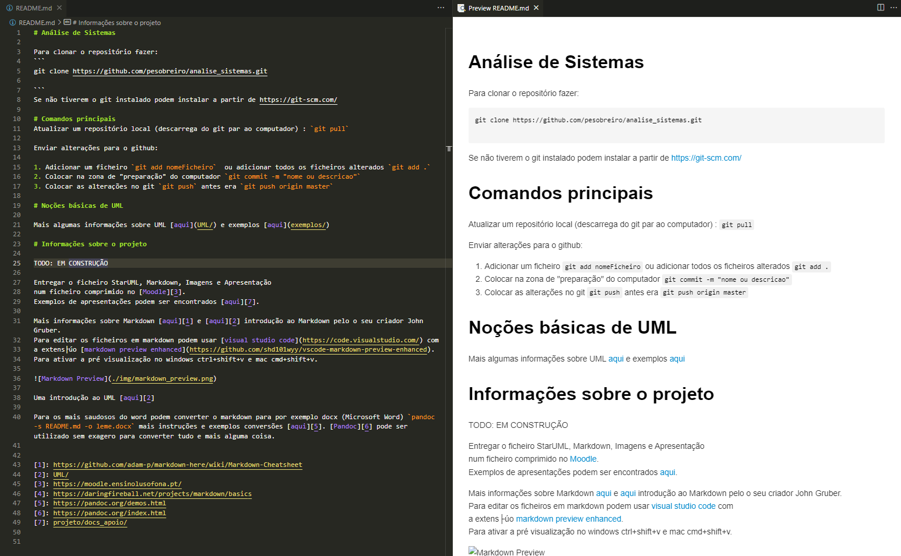

# Análise de Sistemas

Para clonar o repositório fazer: 
```
git clone https://github.com/pesobreiro/analise_sistemas.git

```
Software recomendado:
* Visual Studio Code https://code.visualstudio.com/
* git https://git-scm.com/
* StarUML https://staruml.io/
* Pandoc https://pandoc.org/


# Comandos principais
Atualizar um repositório local (descarrega do git par ao computador) : `git pull`

Enviar alterações para o github:

1. Adicionar um ficheiro `git add nomeFicheiro`  ou adicionar todos os ficheiros alterados `git add .`
2. Colocar na zona de "preparação" do computador `git commit -m "nome ou descricao"`
3. Colocar as alterações no git `git push` antes era `git push origin master`

# Noções básicas de UML

Mais algumas informações sobre UML [aqui](UML/), exemplos [aqui](exemplos/) e [aqui](https://circle.visual-paradigm.com/category/uml-diagrams/use-case/)

# Informações sobre o projeto
TODO: EM CONSTRUÇÃO

Colocar os grupos [aqui](https://docs.google.com/spreadsheets/d/1a5My2zuCotQbwkZel06ojMUggI49vpnfjD-vjJQlhEs/edit?usp=sharing)

Entregar o ficheiro StarUML, Markdown, Imagens e Apresentação
num ficheiro comprimido no [Moodle][3].
Exemplos de apresentações podem ser encontrados [aqui][7].

Mais informações sobre Markdown [aqui][1] e [aqui][2] introdução ao Markdown pelo o seu criador John Gruber.
Para editar os ficheiros em markdown podem usar [visual studio code](https://code.visualstudio.com/) com
a extensão [markdown preview enhanced](https://github.com/shd101wyy/vscode-markdown-preview-enhanced).
Para ativar a pré visualização no windows ctrl+shift+v e mac cmd+shift+v. 



Uma introdução ao UML [aqui][2]

Para os mais saudosos do word podem converter o markdown para por exemplo docx (Microsoft Word) `pandoc -s README.md -o leme.docx` mais instruções e exemplos conversões [aqui][5]. [Pandoc][6] pode ser utilizado sem exagero para converter tudo e mais alguma coisa.


[1]: https://github.com/adam-p/markdown-here/wiki/Markdown-Cheatsheet
[2]: UML/
[3]: https://moodle.ensinolusofona.pt/
[4]: https://daringfireball.net/projects/markdown/basics
[5]: https://pandoc.org/demos.html
[6]: https://pandoc.org/index.html
[7]: projeto/docs_apoio/

