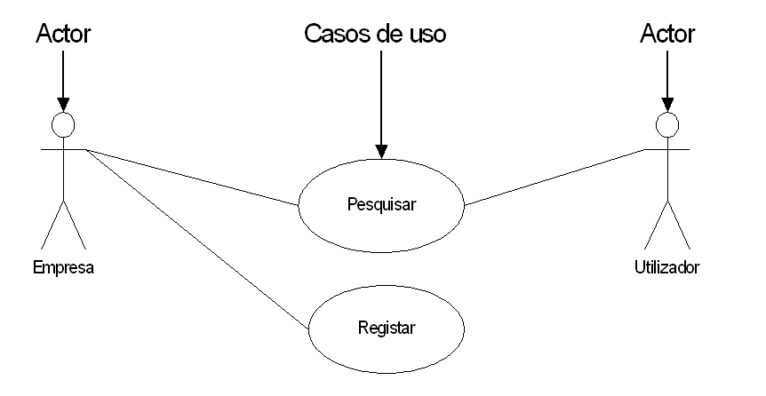
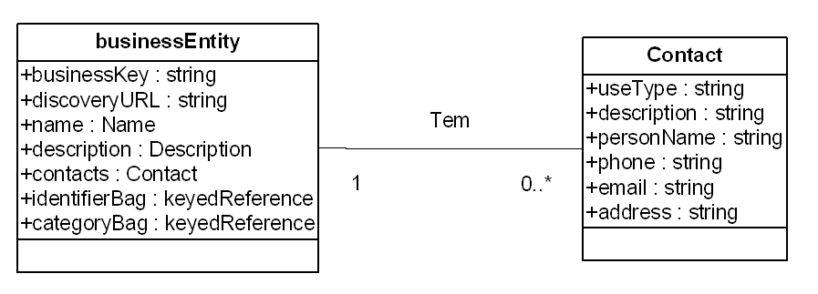
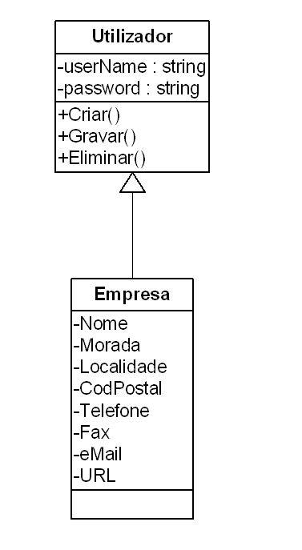
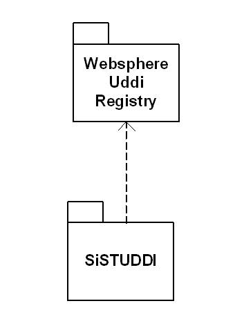

# Unified Modelling Language
## O UML
Durante o fim da década de 80 e o início da década de 90 deu-se o aparecimento de diversas metodologias baseadas na orientação aos objectos, que iriam levar ao aparecimento de três métodos populares. Cada um destes métodos teve os seus pontos fortes:
- Booch teve aspectos positivos no desenho e na implementação. Grady Booch esteve no desenvolvimento da linguagem ADA, onde se destacou no desenvolvimento de técnicas Orientadas a Objectos para a linguagem; 
- OMT (Object Modelling Technique) proposto por Jim Rumbaugh, teve como vantagens na análise e sistemas de informação a utilização intensiva de informação
- OOSE (Object Oriented Software Engineering) desenvolvido por Ivar Jacobson, utilizava um modelo conhecido com Casos de Uso, o que permitia a compreensão do comportamento de um sistema

Em 1994, Jim Rambaugh aliou-se ao Grady Booch na Rational, com o objectivo de criar um standard, o Unified Method. Mais tarde em 1995 Ivar Jacobson também aderiu à Rational, adicionando ao standard os Casos de Uso, o que levou ao aparecimento da UML (Unified Modeling Language).

A primeira versão do UML surgiu em 1996 e em 1997. O UML foi adoptado pelo OMG (Object Management Group).

O UML é uma linguagem para especificar, visualizar, construir e documentar os artefactos de um sistema de software, bem como para a modelação de processos de qualquer outro sistema. O UML representa uma colecção das melhores práticas que se têm provado úteis na modelação de sistemas de grande dimensão e complexidade  (OMG, 2001).

## Modelação com UML
### Casos de Uso
Os diagramas casos de uso constituem um elemento fundamental no UML. Este tipo de diagrama captura o contexto do sistema na perspectiva do utilizador, isto é, o objectivo do sistema em termos de interacção que os utilizadores têm com o mesmo. Podem ser definidos como:

“Uma interacção típica entre o utilizador e um sistema computadorizado”   (Fowler e Scott, 1997). Nestes diagramas em que a figura os objectos “actor” e “casos de uso” são definidos da seguinte forma (Rumbaugh, [et al.], 1999):
- Actor – Representa uma pessoa externa, processo ou coisa que está em interacção com o sistema, subsistema ou classe. Um actor caracteriza a interacção de utilizadores externos com o sistema.

É uma unidade coerente de uma funcionalidade visível do exterior fornecida por um elemento do sistema, sendo expressa por sequências de mensagens trocadas por um elemento do sistema com um ou mais actores com a unidade do sistema.

### Diagrama de classes
Modelo conceptual que identifica os conceitos, atributos e associações no domínio. Representa num diagrama a estrutura estática do modelo, descrevendo as classes, os seus tipos, a sua estrutura interna e a relações existentes entre as classes.

O diagrama de classes descreve os tipos de objectos no sistema e os diversos tipos de relações estáticas que existem entre elas (Fowler e Scott, 1997).
As relações que podem ser realizadas entre as classes são (Rumbaugh, [et al.], 1999):

- Associações – Representam a estrutura de dependências entre os objectos. Identifica os objectos de uma classe que estão relacionados com os objectos de outra classe

- Generalizações – Consiste numa relação entre uma elemento geral e uma mais específica que é construída sobre o elemento geral e o estende.

- Dependências – Indica que a alteração na especificação de um elemento pode afectar outro elemento que a usa, mas não obrigatoriamente o oposto. Este tipo de relação permite que se represente a relação a utilizar por parte de uma classe e de outra como argumento

### Diagrama de interação

Estes diagramas representam as interacções entre os objectos, colocando em ênfase os aspectos particulares de mesma realidade. Os diagramas de interacção podem ser apresentados de duas formas: 
-	Diagramas de Sequência representam um conjunto de mensagens organizadas numa sequência temporal. Este tipo de diagramas têm duas dimensões:
	- Vertical, que representa o tempo;
	- Horizontal, que representa os objectos participantes numa sequência de eventos necessários para atingir o objectivo;
- Diagramas de Colaboração, representam interacções organizadas espacialmente de uma forma distinta dos diagramas de sequência. Um diagrama de colaboração mostra as relações entre os objectos que desempenham papéis diferentes realizadas em torno dos objectos e das suas ligações com os restantes.

### Diagramas de estado

Permitem modelar o comportamento interno de um determinado objecto, subsistema ou sistema global, representando a sequência de estados de um determinado objecto. Este tipo de diagramas representam os estados possíveis de um objecto. As transições entre estados, os eventos que fazem desencadear as transições e as operações que são executados dentro de um estado ou transição.

### Diagramas de arquitectura
Descrevem aspectos relativos à fase de implementação e instalação de um sistema de software, concretamente a estrutura e dependências de código fonte e módulos executáveis. Podem ser representados por duas formas, diagramas de componentes e diagramas de instalação.
- Diagramas de componentes, Representam as dependências entre os componentes de software, ilustrando as dependências entre os vários componentes;
- Diagramas de instalação, demonstram a configuração dos elementos de processamento e dos componentes de software, processos e objectos neles suportados;

# Referências
OMG, Unified Modeling Language Specification [em linha]. OMG, 2001 [citado em 10 de Março de 2002]. Disponível em <URL:
http://www.omg.org>

RUMBAUGH, James, JACOBSON, Ivar e BOOCH, Grady - The Unified Modeling Language Reference Manual. U.S.A.: Addison-Wesley, 1999. 550 p. ISBN 0-201-30998-X.

FOWLER, Martin e SCOTT, Kendall - UML Distilled Applying the Standard Object Modeling Language. EUA: Addison-Wesley, 1997. 179 p. ISBN 0-201-32563-2.
