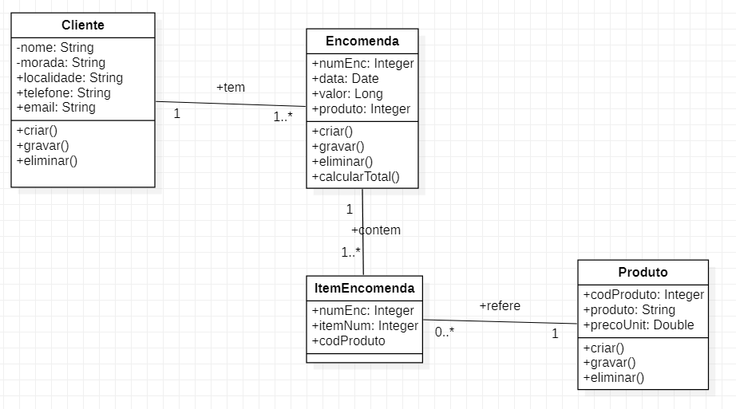
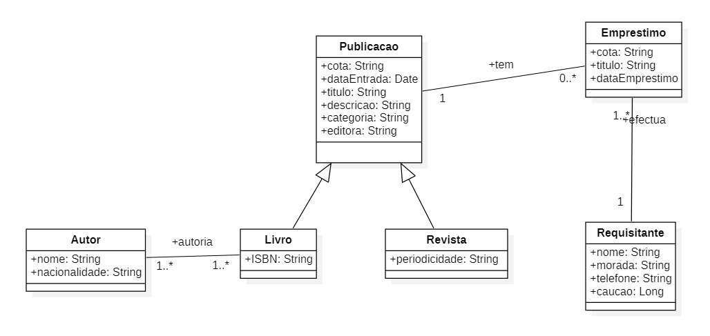

# Diagrama de classes
## Encomendas de produtos
- Definir o diagrama de classe de um site de vendas online de material informático;
- Um cliente pode realizar várias encomendas, onde cada encomenda pode conter vários produtos e a respetiva quantidade encomendada;
- Construa um diagrama de classes simplificado, considerando só os elementos fundamentais;

## Encomendas de livros
- Uma biblioteca possui dois tipos de publicações, livros e revistas. Um interessado em requisitar uma publicação tem que preencher uma ficha de empréstimo, preenchendo a cota (conjunto de letras e número para identificar) e o título. Se for um livro tem que preencher os autores. 
- O requisitante tem que pagar uma caução. Disponibilizar o telefone de contacto e morada
- As publicações novas são catalogadas por um responsável pela catalogação, onde é definida a área de conhecimento. Nos livros tem que ser registado o número de identificação internacional, ISBN e periodicidade nas revistas.

